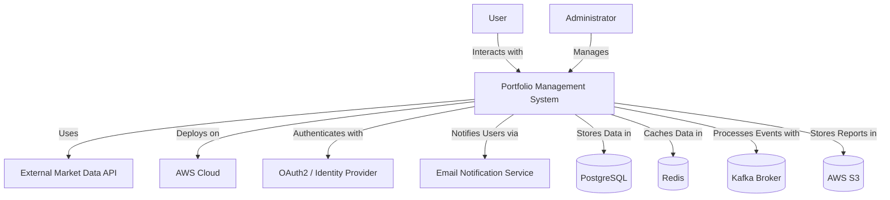

# Portfolio Management System

The **Portfolio Management System** is a cloud-native, microservices-based application designed to help users manage their financial portfolios efficiently. This system is deployed on **AWS** and leverages various modern technologies, including **Spring Boot, Kafka, PostgreSQL, Redis, and Docker**.

## System Architecture

The system follows a **microservices architecture** where different services handle specific functionalities. These services communicate via **REST APIs and Kafka for event-driven messaging**.

### High-Level System Context

## Communication Between Services

- **API Gateway**: Acts as the entry point for users and routes requests to the appropriate microservices.
- **Service Discovery (Eureka)**: Enables dynamic service registration and discovery.
- **Synchronous Communication**: RESTful APIs are used for direct service-to-service interaction.
- **Asynchronous Communication**: Kafka is used for event-driven messaging to decouple services and improve scalability.
- **Database & Caching**: PostgreSQL serves as the primary data store, while Redis is used for caching frequently accessed data.

## Deployment

The system is containerized using **Docker** and orchestrated using **Kubernetes on AWS (EKS)**. Other AWS services such as **S3** (for storage) and **SNS/SQS** (for notifications) are also integrated.

## Future Enhancements

- Implementing GraphQL for optimized data fetching.
- Enhancing monitoring with Prometheus & Grafana.
- Expanding event-driven capabilities with additional Kafka topics.

---
This README provides a **high-level overview** of the system. For detailed documentation, refer to the individual microservice documentation.
